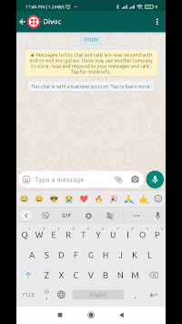

# twillio-watson

Amidst of the pandemic it is difficult to find Oxygen, vaccine, beds for Covid patients. For this people are using Twitter.

But not many people are accustomed to twitter search, so I created a Whatsapp Bot which will talk to the user. The user will ask questions like "I am searching for Oxygen in bangalore", this message will be picked up by Twillio and will call a node hook. The node server will parse the question with the help of IBM watson and will fetch the results from Twitter and send it back to User.

`This repo is just a small representation of my original private repository for this project.`

# sample usage

